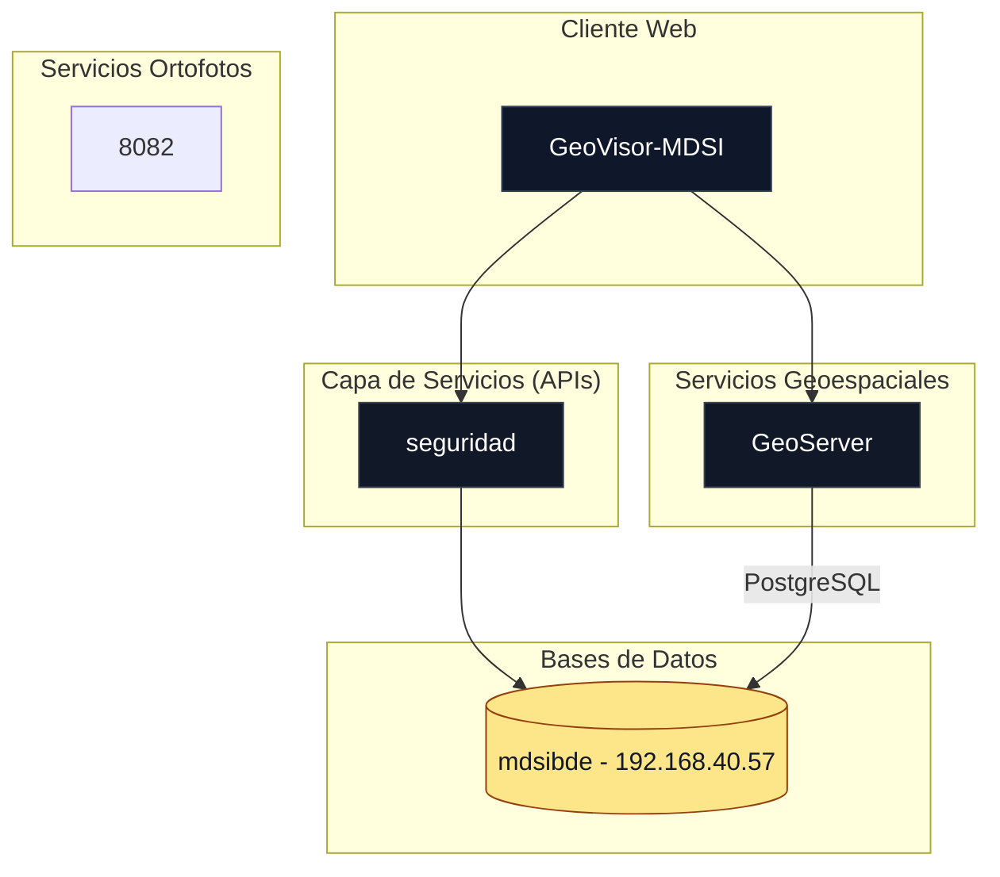

## 📦 Diagrama de componentes:

```mermaid
graph TB
  %% =========================
  %% COMPONENTES
  %% =========================
  subgraph "Cliente Web"
    FRONT[GeoVisor-MDSI]
  end

  subgraph "Capa de Servicios (APIs)"
    AUTH[seguridad]
  end

  subgraph "Bases de Datos"
    DB1[(mdsibde - 192.168.40.57)]
  end
  
  subgraph "Servicios Geoespaciales"
    GEOSERVER[GeoServer]
  end

  subgraph "Servicios Ortofotos"
    192.168.40.57[8082]
  end

  %% =========================
  %% RELACIONES
  %% =========================
  FRONT --> AUTH
  FRONT --> GEOSERVER

  AUTH --> DB1
  GEOSERVER -- "PostgreSQL" --> DB1

  %% =========================
  %% ESTILOS
  %% =========================
  classDef front fill:#0f172a,stroke:#334155,stroke-width:1px,color:#fff;
  classDef service fill:#111827,stroke:#374151,stroke-width:1px,color:#fff;
  classDef db fill:#fde68a,stroke:#92400e,stroke-width:1px,color:#111827;

  class FRONT front;
  class AUTH,GEOSERVER service;
  class DB1 db;
```