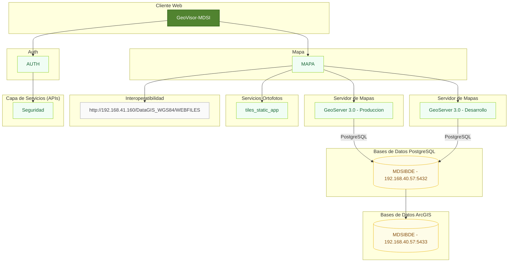

# Aplicativo Visor Geográfico del Visor Municipalidad de San Isidro

Aplicación frontend desarrollada con **Angular 17.2**.

---

## 🚀 Tecnologías

- Angular 20.0.0
- TypeScript
- RxJS
- Angular CLI
- HTML5 / TAILWIND
- Node.js ≥ 20

---

## 📦 Requisitos previos

- Node.js 20 o superior
- npm 9+ o yarn
- Angular CLI

```bash
npm install -g @angular/cli
```

---


## 🔐 Configuración de entornos

Los entornos se configuran en:

```
src/environments/
```

---

## 📏 Estándares y buenas prácticas

- Arquitectura modular
- Lazy loading para módulos
- Tipado estricto habilitado
- ESLint configurado
- Angular Style Guide
- Separación clara de responsabilidades

---

## 🔀 Flujo de trabajo Git

- Rama principal: `main`
- Desarrollo y Producción: `main`
- Features: `feature/hu*`
- Fixes: `hotfix/*`


---

## 📦 Diagrama de componentes:


---

## 🌍 Links de las publicaciones:

[Local](http://localhost:4200/)

[Desarrollo](http://192.168.40.58:80)

[Producción - IP](http://192.168.40.58:80)

[Producción - URL](https://visor.mdsi.gob.pe/)

[Producción - GeoServer](https://geoserver.mdsi.gob.pe/)