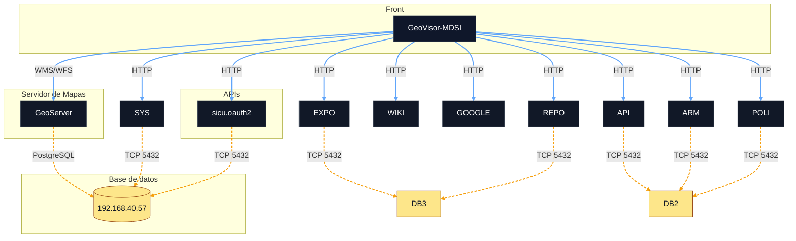

## 📦 Diagrama de componentes:

```mermaid
flowchart TB
  %% =========================
  %% CAPAS
  %% =========================
  subgraph L1[Front]
    direction LR
    FRONT[GeoVisor-MDSI]
  end

  subgraph L2[APIs]
    direction LR    
    AUTH[sicu.oauth2]    
  end

  subgraph L3[Base de datos]
    direction LR
    DB1[(192.168.40.57)]    
  end
  subgraph L4[Servidor de Mapas]
    direction LR
    GEOSERVER[GeoServer]    
  end

  %% =========================
  %% RELACIONES
  %% =========================
  FRONT -->|HTTP| EXPO
  FRONT -->|HTTP| REPO
  FRONT -->|HTTP| API
  FRONT -->|HTTP| SYS
  FRONT -->|HTTP| AUTH
  FRONT -->|HTTP| ARM
  FRONT -->|HTTP| POLI
  FRONT -->|WMS/WFS| GEOSERVER
  FRONT -->|HTTP| WIKI
  FRONT -->|HTTP| GOOGLE
  EXPO -.->|TCP 5432| DB3
  REPO -.->|TCP 5432| DB3
  API -.->|TCP 5432| DB2
  ARM -.->|TCP 5432| DB2
  POLI -.->|TCP 5432| DB2
  GEOSERVER -.->|PostgreSQL| DB1
  SYS -.->|TCP 5432| DB1
  AUTH -.->|TCP 5432| DB1

  %% =========================
  %% ESTILOS
  %% =========================
  classDef front fill:#0f172a,stroke:#334155,stroke-width:1px,color:#fff;
  classDef service fill:#111827,stroke:#374151,stroke-width:1px,color:#fff;
  classDef db fill:#fde68a,stroke:#92400e,stroke-width:1px,color:#111827;
  classDef cloud fill:#e0f2fe,stroke:#0284c7,stroke-width:1px,color:#0f172a;

  class FRONT front;
  class API,SYS,ARM,AUTH,REPO,POLI,EXPO,WIKI,GOOGLE,GEOSERVER service;
  class DB1,DB2,DB3 db;

  %% (Opcional) estilo de links
  linkStyle 0,1,2,3,4,5,6,7,8,9 stroke:#60a5fa,stroke-width:2px;
  linkStyle 10,11,12,13,14,15,16,17 stroke:#f59e0b,stroke-width:2px,stroke-dasharray:5 3;
```