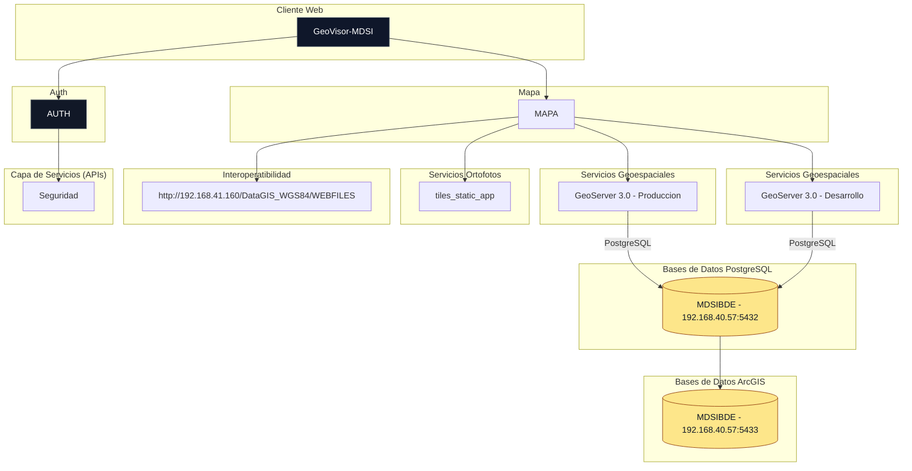

## 📏 Estándares y buenas prácticas

- Arquitectura modular
- Lazy loading para módulos
- Tipado estricto habilitado
- ESLint configurado
- Angular Style Guide
- Separación clara de responsabilidades

---

## 📦 Diagrama de componentes:

---

## 🌍 Links de las publicaciones:

[Local](http://localhost:4200/)

[Desarrollo](http://192.168.40.58:80)

[Producción - IP](http://192.168.40.58:80)

[Producción - URL](https://visor.mdsi.gob.pe/)

[Producción - GeoServer](https://geoserver.mdsi.gob.pe/)