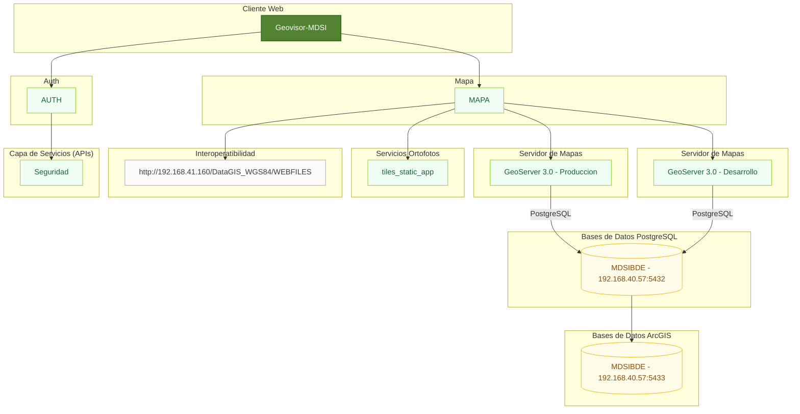

# Aplicativo Visor Geográfico del Visor Municipalidad de San Isidro

Aplicación frontend desarrollada con **Angular 20**.

---

## 🚀 Tecnologías

- Angular 20.0.0
- TypeScript
- RxJS
- Angular CLI
- HTML5 / TAILWIND
- Node.js ≥ 20

---

## 📦 Requisitos previos

- Node.js 20 o superior
- npm 9+ o yarn
- Angular CLI

```bash
npm install -g @angular/cli
```

---


## 🔐 Configuración de entornos

Los entornos se configuran en:

```
src/environments/
```

### Ambientes disponibles

| Archivo | Ambiente | Portal / API base | GeoServer |
|---|---|---|---|
| `environment.ts` | **Desarrollo** | `https://test.munisanisidro.gob.pe` | `http://192.168.40.58:8081/geoserver` (red interna) |
| `environment.qa.ts` | **QA** | `https://test.munisanisidro.gob.pe` | `http://192.168.40.58:8081/geoserver` (red interna) |
| `environment.prod.ts` | **Producción** | `https://munisanisidro.gob.pe` | `https://geomapas.munisanisidro.gob.pe/geoserver` (público) |

Los tres archivos se generan con la fábrica `crearEnvironment()` de
`src/environments/environment.model.ts`, que centraliza toda la configuración
(GeoServer, DataGIS, TUSNE, APIs WSGEOVISOR, Observatorio Urbano, etc.).
Si algún servidor interno cambia por ambiente, se pasa como override:

```ts
export const environment = crearEnvironment({
  production: true,
  ambiente: 'Producción',
  portalUrl: 'https://munisanisidro.gob.pe',
  // overrides opcionales de servidores internos:
  // geoserverUrl, ortofotoServerUrl, dataGisServerUrl, tusneServerUrl
});
```

### Comandos por ambiente

#### 🧑💻 Desarrollo

```bash
# Levantar el servidor de desarrollo (http://localhost:4200 · usa proxy.conf.json)
npm start

# Build de desarrollo (sin optimizar y con sourcemaps) → dist/visor-mdsi/browser
ng build --configuration development

# Build de desarrollo en modo watch (recompila automáticamente al guardar)
npm run watch
```

#### 🏭 Producción

```bash
# Build de producción (optimizado, con hashing y environment.prod.ts)
npm run build:prod          # equivale a: ng build -c production

# Atajo: 'npm run build' TAMBIÉN compila producción, porque el
# defaultConfiguration del target build es "production" (ver angular.json)
npm run build               # equivale a: ng build -c production
```

> ⚠️ **Ojo:** `npm run build` **no** compila para desarrollo: por defecto usa la
> configuración `production` (`defaultConfiguration: "production"` en
> `angular.json`). Para un build de desarrollo usa `ng build --configuration
> development` o `npm run watch`.

#### 🔍 QA (referencia)

```bash
npm run start:qa            # servir la configuración QA localmente
npm run build:qa            # compilar para QA (equivale a: ng build -c qa)
```

**Salida del build:** `dist/visor-mdsi/browser/` (contiene el `index.html` y los
`.js`/`.css` con hash de contenido, listos para publicar en Nginx).

La selección del ambiente se hace mediante `fileReplacements` en
`angular.json`: la configuración `qa` sustituye `environment.ts` por
`environment.qa.ts` y la configuración `production` por `environment.prod.ts`,
de modo que el bundle final solo contiene las URLs del ambiente elegido.

---


## 📏 Estándares y buenas prácticas

- Arquitectura modular
- Lazy loading para módulos
- Tipado estricto habilitado
- ESLint configurado
- Angular Style Guide
- Separación clara de responsabilidades

---

## 🔀 Flujo de trabajo Git

- Rama principal: `main`
- Desarrollo y Producción: `main`
- Features: `feature/hu*`
- Fixes: `hotfix/*`


---

## 📦 Diagrama de componentes:


```mermaid
graph TB
  %% =========================
  %% COMPONENTES
  %% =========================
  subgraph "Cliente Web"
    FRONT[Geovisor-MDSI]
  end 

  subgraph "Auth"
    AUTH[AUTH]
  end

  subgraph "Mapa"
    MAPA[MAPA]
  end

  subgraph "Bases de Datos PostgreSQL"
    DB1[(MDSIBDE - 192.168.40.57:5432)]
  end

  subgraph "Bases de Datos ArcGIS"
    DB2[(MDSIBDE - 192.168.40.57:5433)]
  end
  
  subgraph "Servidor de Mapas"
    GEOSERVER_PROD[GeoServer 3.0 - Produccion]
  end

  subgraph "Servidor de Mapas"
    GEOSERVER_DEV[GeoServer 3.0 - Desarrollo]
  end

  subgraph "Servicios Ortofotos"
    ORTOFOTOS[tiles_static_app]
  end

  subgraph "Interoperatibilidad"
    INTER[http://192.168.41.160/DataGIS_WGS84/WEBFILES]
  end

  subgraph "Capa de Servicios (APIs)"
    SEGURIDAD[Seguridad]
  end  

  %% =========================
  %% RELACIONES
  %% =========================
  FRONT --> AUTH
  FRONT --> MAPA
  AUTH --> SEGURIDAD
  MAPA --> GEOSERVER_PROD
  MAPA --> GEOSERVER_DEV
  MAPA --> ORTOFOTOS
  MAPA --> INTER
  DB1 --> DB2
  
  GEOSERVER_PROD -- "PostgreSQL" --> DB1
  GEOSERVER_DEV -- "PostgreSQL" --> DB1
  

  %% =========================
  %% ESTILOS
  %% =========================
  classDef front fill:#518330,stroke:#3b6d22,stroke-width:2px,color:#fff;
  classDef service fill:#f0fdf4,stroke:#84cc16,stroke-width:1px,color:#166534;
  classDef db fill:#fefce8,stroke:#eab308,stroke-width:1px,color:#854d0e;
  classDef external fill:#fafafa,stroke:#a1a1aa,stroke-width:1px,color:#3f3f46;

  class FRONT front;
  class AUTH,MAPA,GEOSERVER_PROD,GEOSERVER_DEV,ORTOFOTOS,SEGURIDAD service;
  class INTER external;
  class DB1 db;
  class DB2 db;
```
---

## 🌍 Links de las publicaciones:

[Local](http://localhost:4200/)

[Producción - URL](https://geovisorcatastral.munisanisidro.gob.pe)

[Producción - GeoServer](https://geomapas.munisanisidro.gob.pe)